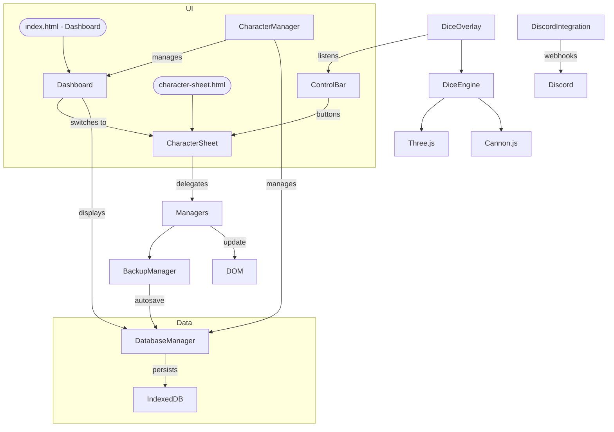

# The Ledger - Vampire: The Masquerade V5 Character Sheet

> Version 1.3.0.1 – Last updated 25 January 2025

Welcome to the technical documentation for **The Ledger**, an offline-first web app for managing *Vampire: The Masquerade* 5th Edition characters.

This documentation is aimed at developers who want to understand, contribute to, or extend the code-base.  If you are looking for user instructions, see the project's top-level README.md.

---

## Contents

1. [System Overview](#system-overview)
2. [Folder & File Layout](#folder--file-layout)
3. [Front-End Stack](#front-end-stack)
4. [Runtime Architecture](#runtime-architecture)
5. [Major JavaScript Modules](#major-javascript-modules)
6. [Data Layer](#data-layer)
7. [Dice Engine](#dice-engine)
8. [Build & Tooling](#build--tooling)
9. [Conventions & Coding Style](#conventions--coding-style)
10. [Extending the App](#extending-the-app)
11. [FAQ / Troubleshooting](#faq--troubleshooting)
12. [Development Workflow](#development-workflow)
13. [Component Architecture](#component-architecture)
14. [Theme System](#theme-system)
15. [Accessibility](#accessibility)

---

## System Overview

The Ledger is a **purely client-side, single-page application** built with vanilla JavaScript, jQuery, Bootstrap 5 and SCSS.  All data is stored in-browser using IndexedDB for robust character management and persistence, with JSON export/import capabilities; there is *no* server component.

Key design goals:

* **Offline-first** – must run from a local `index.html` without a network connection.
* **Multiple character support** – manage multiple characters with seamless switching via a dashboard interface.
* **Robust data persistence** – IndexedDB provides reliable storage with automatic backups.
* **Minimal build pipeline** – only SCSS compilation is required for development.
* **Source-of-truth data** – rules data is imported from the community-maintained [VTM Wiki](https://vtm.paradoxwikis.com/VTM_Wiki).
* **Modular JS** – each logical sheet section has a dedicated manager module.
* **Game-accurate dice** – optional 3-D dice overlay using Three.js & Cannon.js.
* **Theme-aware** – comprehensive theming system with clan-specific color schemes.
* **Accessible** – ARIA attributes, keyboard navigation, and screen reader support.
* **Discord integration** – optional webhook integration for sharing dice rolls and character updates.

---

## Folder & File Layout

```text
├── index.html                # Main HTML entry (dashboard interface)
├── character-sheet.html      # Character sheet interface
├── css/                      # Compiled CSS (ignored in VCS)
├── scss/                     # Source stylesheets (Sass)
│   ├── _variables.scss      # Design tokens & theme variables
│   ├── _mixins.scss         # Reusable SCSS mixins
│   ├── _globals.scss        # Global styles
│   ├── _responsive.scss     # Media queries & responsive design
│   ├── main.scss            # Main entry point
│   ├── base/                # Base styles
│   │   ├── _typography.scss # Typography system
│   │   ├── _utilities.scss  # Utility classes
│   │   └── typography.scss  # Font imports & setup
│   ├── components/          # Reusable UI components
│   │   ├── _forms.scss      # Form controls & inputs
│   │   ├── _modals.scss     # Modal dialogs
│   │   ├── _clan-themes.scss# Clan-specific themes
│   │   ├── _theme-overrides.scss # Theme customization
│   │   ├── _sticky-header.scss # Sticky header styles
│   │   ├── _tracks.scss     # Health/Willpower tracks
│   │   ├── _buttons.scss    # Button variants
│   │   ├── _tooltips.scss   # Info tooltips
│   │   └── _dashboard.scss  # Dashboard interface styles
│   ├── layout/              # Layout-specific styles
│   └── features/            # Feature-specific styles
├── js/
│   ├── core/
│   │   ├── managers/        # Character data managers
│   │   │   ├── database-manager.js   # IndexedDB operations & data persistence
│   │   │   ├── character-manager.js  # Multiple character management & UI
│   │   │   ├── discipline-manager.js # Manages Disciplines UI & state
│   │   │   ├── background-manager.js # Backgrounds, Advantages & Flaws
│   │   │   ├── merit-flaw-manager.js # Merits & Flaws (prints inside Backgrounds)
│   │   │   ├── specialty-manager.js  # Skill Specialities
│   │   │   ├── loresheet-manager.js  # Loresheets section
│   │   │   ├── coterie-manager.js    # Coterie information
│   │   │   ├── conviction-manager.js # Convictions & Touchstones
│   │   │   ├── lock-manager.js       # Global Lock / Play mode
│   │   │   ├── xp-manager.js         # Experience Points tracker & history
│   │   │   ├── xp-spend-manager.js   # XP spending modal & trait purchasing
│   │   │   ├── backup-manager.js     # JSON import / export / autosave
│   │   │   └── manager-utils.js      # Shared helpers for manager modules
│   │   ├── ui/              # User interface components
│   │   │   ├── character-sheet.js    # Core sheet initialisation & orchestration
│   │   │   ├── dashboard.js          # Dashboard interface & character management
│   │   │   ├── character-toolbar.js  # Character-specific toolbar
│   │   │   ├── control-bar.js        # Sticky toolbar (save, load, roll, etc.)
│   │   │   ├── dice-overlay.js       # 3-D overlay + UI toolbar
│   │   │   ├── info-buttons.js       # Info mode & reference system
│   │   │   ├── sticky-header.js      # Sticky header component
│   │   │   └── accessibility-fix.js  # Misc ARIA / keyboard tweaks
│   │   └── utils/           # Utility functions
│   │       ├── dice.js               # Core dice physics/render (Three.js + Cannon.js)
│   │       ├── dice-vtm.js           # V5-specific dice logic (hunger, crits, bestial)
│   │       ├── disciplines.js        # Static Discipline definitions (ES module)
│   │       └── xp-pricing.js         # XP cost calculations
│   ├── data/                # Static game data
│   │   ├── attributes.js
│   │   ├── backgrounds-coterie.js
│   │   ├── backgrounds.js
│   │   ├── blood_potency.js
│   │   ├── clans/           # Clan-specific data
│   │   ├── clans.js
│   │   ├── compulsions.js
│   │   ├── coterie_types.js
│   │   ├── disciplines/     # Discipline-specific data
│   │   ├── disciplines.js
│   │   ├── factions/        # Faction-specific data
│   │   ├── generation.js
│   │   ├── humanity.js
│   │   ├── loresheets.js
│   │   ├── merits.js
│   │   ├── predator_types.js
│   │   ├── resonances.js
│   │   └── skills.js
│   ├── integrations/        # External integrations
│   │   └── discord-integration.js    # Discord webhook integration
│   └── lib/                 # Vendored libraries
│       ├── cannon.min.js
│       ├── teal.min.js
│       └── three.min.js
├── assets/                   # Images, icons, fonts
├── data/                     # **↯   Rules data sourced from Progeny & VTM Wiki**
├── reference/                # Additional reference materials
├── .vscode/                  # VS Code workspace settings
├── DOCUMENTATION.md          # Technical docs (this file)
├── CHANGELOG.md             # Version history
├── README.md                # Project overview & user guide
├── package.json             # npm scripts & dev-deps
└── .gitignore               # Git ignore rules
```

---

## Front-End Stack

| Layer                  | Tech / Library  | Purpose |
| ---------------------- | --------------- | ------- |
| DOM & events           | Vanilla JS + jQuery 3.x | Simpler cross-browser DOM edits |
| Layout & components    | Bootstrap 5     | Grid, utilities, basic components |
| Styling                | SCSS            | Variables & nesting; compiled via `sass` |
| Data persistence       | IndexedDB       | Robust character storage & settings |
| 3-D engine             | Three.js r73    | WebGL rendering of dice |
| Physics                | Cannon.js 0.6.2 | Rigid-body simulation for dice |
| Dice face generator    | TealDice (fork) | Converts canvas textures into mesh materials |
| Build / tasks          | npm scripts + Sass | No bundler required |

---

## Runtime Architecture



• **index.html** serves as the main dashboard interface for character management and creation.
• **character-sheet.html** contains semantic markup for every sheet cell. Manager modules enhance these nodes at runtime.
• **Dashboard** provides character grid, creation interface, and management tools.
• **Control Bar** emits custom events (`save`, `load`, `roll`) caught by the appropriate modules.
• **Character Manager** handles multiple character support with seamless switching.
• **Database Manager** provides IndexedDB operations for robust data persistence.
• **BackupManager** serialises the DOM-derived character model into JSON and vice-versa.
• **DiceOverlay** is lazily loaded; if disabled, none of the large 3-D libs are downloaded.
• **Discord Integration** provides optional webhook functionality for sharing dice rolls.

---

## Major JavaScript Modules

### `dashboard.js`
Manages the main dashboard interface for character management, creation, and system selection.

Key features:
* Character grid display with cards
* New character creation interface
* System selection (Vampire, Hunter, Werewolf)
* Character import from various sources
* Settings management
* Theme switching

### `character-sheet.js`
Responsible for bootstrapping the character sheet: loops over DOM sections, initialises the relevant manager, and wires cross-section interactions.

Key exports:
* `init()` – main entry called on DOM-ready.
* `registerManager(name, instance)` – dynamic plugin registry.

### `database-manager.js`
Handles all IndexedDB operations for character data and settings persistence. Provides a clean API for character CRUD operations and settings management.

Key methods:
* `init()` – initializes the IndexedDB database
* `saveCharacter(data, id)` – saves or updates character data
* `getCharacter(id)` – retrieves character by ID
* `getAllCharacters()` – retrieves all characters
* `deleteCharacter(id)` – removes a character
* `getSetting(key)` / `setSetting(key, value)` – settings management

### `character-manager.js`
Manages multiple character support with UI for character switching, creation, and management.

Key features:
* Character selector dropdown
* New character creation
* Character management modal
* Seamless character switching
* Automatic data persistence

### `manager-utils.js`
Common helper functions: value parsing, dot creation, tooltip wiring, REST-like fetch of reference JSON, and unified toast notification system.

### Manager classes
| Module | Responsibility |
| ------ | -------------- |
| `discipline-manager.js` | Dynamic Discipline cards, level pickers, cost validation |
| `background-manager.js` | Background dots, custom notes |
| `merit-flaw-manager.js` | Toggleable Merits/Flaws, XP calc |
| `specialty-manager.js`  | Skill specialities with validation |
| `loresheet-manager.js`  | Tiered loresheet picker |
| `coterie-manager.js`    | Coterie merits, size rules |
| `conviction-manager.js` | Conviction tracking, Touchstone management |
| `info-buttons.js`       | Info mode & reference system |
| `sticky-header.js`      | Sticky header component |
| `lock-manager.js`       | Global Lock / Play mode – toggles sheet interactivity |
| `xp-manager.js`         | Tracks awarded/spent XP, undo/redo history, persistence |
| `xp-spend-manager.js`   | Modal interface for purchasing trait increases using XP |
| `xp-pricing.js`         | XP cost calculations for different trait types |

### `backup-manager.js`
Serialises/deserialises the current sheet as **Ledger JSON v1** (see Data Layer).
Also exposes `downloadJSON()` and `loadFromFile()` helpers. Now integrates with IndexedDB for automatic character persistence.

### `dice-overlay.js`
Creates a full-window transparent canvas, initialises `dice.js`, and exposes `rollDice(config)` given a dice notation (`5v/2h` = 5 normal, 2 hunger).  Listens for `Ctrl + R` keyboard shortcut.

### `discord-integration.js`
Provides Discord webhook integration for sharing dice rolls and character updates. Includes webhook validation and structured embed creation.

Key features:
* Webhook URL management
* Roll result formatting
* Character name integration
* Settings persistence

### `info-buttons.js`
Provides context-sensitive information display for game mechanics and rules. Replaces the older tooltip system with a more comprehensive reference system.

---

## Data Layer

All reference data lives in `js/data/` and `data/`:

* **Source projects:**
  * [@prncc/vampire-dice-roller](https://github.com/prncc/vampire-dice-roller)
  * [Odin94/Progeny-vtm-v5-character-creator](https://github.com/Odin94/Progeny-vtm-v5-character-creator/)
  * [VTM Wiki](https://vtm.paradoxwikis.com/VTM_Wiki)
* **Format:** Plain ES Modules exporting arrays/objects or static JSON.

### IndexedDB Schema

The application uses IndexedDB with two object stores:

* **characters** – stores character data with auto-incrementing IDs
  * Indexes: name, createdAt, updatedAt
* **settings** – stores application settings (theme, Discord webhook, etc.)
  * Key: setting name, Value: setting value

### Ledger JSON v1 (export example)

```jsonc
{
  "meta": { "format": 1, "generated": "2025-01-25T18:22:00Z" },
  "info": {
    "name": "Dr Jane Doe",
    "concept": "Reluctant Scholar",
    "clan": "Tremere",
    "generation": 12,
    "chronicle": "Chicago by Night"
  },
  "attributes": {
    "physical": { "strength": 2, "dexterity": 1, "stamina": 3 },
    "social": { "charisma": 3, "manipulation": 2, "composure": 2 },
    "mental": { "intelligence": 3, "wits": 2, "resolve": 3 }
  },
  "skills": { /* … */ },
  "disciplines": [ { "name": "Auspex", "level": 2 } ],
  "convictions": [
    {
      "description": "Never harm the innocent",
      "touchstone": {
        "name": "Sarah Chen",
        "relationship": "Former student",
        "summary": "Represents my commitment to education",
        "lost": false
      }
    }
  ],
  "tracks": {
    "health": { "max": 6, "aggravated": 0, "superficial": 0 },
    "willpower": { "max": 5, "aggravated": 1, "superficial": 2 },
    "humanity": { "current": 7, "stains": 1 }
  },
  "xp": { "total": 20, "spent": 15, "history": [] },
  "locked": false
}
```

---

## Dice Engine

* **three.min.js** – r73 (lighter, ES5 for better local-file compatibility).
* **cannon.min.js** – physics integration.
* **dice.js** – Generic dice mesh builder.  Heavily refactored to support custom face textures.
* **dice-vtm.js** – Implements V5 dice rules:
  * Hunger dice (red faces)
  * Criticals & messy crits
  * Bestial failure logic

The engine exposes two global functions once loaded:

```js
window.diceBox.initialize(canvasEl, { theme: 'ledger' });
window.diceBox.roll('7v/3h'); // 7 regular, 3 hunger
```

---

## Build & Tooling

Command | Description
--------|------------
`npm install` | installs `sass` (dart-sass)
`npm run sass` | watches `scss/` → `css/`
`npm run sass:build` | one-off compressed build

There is **no bundler** – scripts are loaded via `<script type="module">` or classic `<script>` tags with `defer`.

---

## Conventions & Coding Style

* **Linting:** not enforced currently; follow Airbnb JS where reasonable.
* **Modules:** keep each manager self-contained; expose a default class with `init()`.
* **DOM selectors:** always query via ids/classes defined in HTML; avoid brittle text-based selectors.
* **Data persistence:** use IndexedDB exclusively through the database manager.
* **Toast notifications:** use the unified `ToastManager` from `manager-utils.js`.

---

## Development Workflow

1. **Setup**
   ```bash
   git clone https://github.com/yourusername/Ledger.git
   cd Ledger
   npm install
   npm run sass
   ```

2. **Development**
   - Run `npm run sass` to watch SCSS changes
   - Open `index.html` directly in browser (no server needed)
   - Use browser dev tools for debugging
   - Test multiple character functionality

3. **Testing**
   - Test in multiple browsers (Chrome, Firefox, Safari)
   - Verify offline functionality
   - Check IndexedDB persistence
   - Test character switching and management
   - Check accessibility with screen readers
   - Test Discord integration (if enabled)

4. **Building**
   ```bash
   npm run sass:build
   ```

---

## Component Architecture

### Dashboard Interface
- Character grid with cards
- System selection interface
- Character creation workflow
- Import functionality (Ledger, Progeny)
- Settings management
- Theme switching

### Character Management
- Character selector dropdown
- New character creation modal
- Character management interface
- Seamless character switching
- Automatic data persistence

### Form Controls
- Auto-resizing textareas
- Theme-aware inputs
- Custom checkboxes and radio buttons
- Responsive grid layouts

### Modals
- Bootstrap-based dialogs
- Custom animations
- Theme-aware styling
- Keyboard navigation

### Tracks
- Health/Willpower/Humanity
- Superficial/Aggravated damage
- Visual feedback
- Touch-friendly

### Theme System
- Clan-specific color schemes
- Dark/Light mode support
- CSS custom properties
- Runtime switching

---

## Theme System

The theme system is built on CSS custom properties and SCSS variables:

```scss
:root {
  --accent: #{$clan-accent};
  --panel-bg: #{$panel-bg};
  --text-color: #{$text-color};
  // ... more variables
}
```

Theme switching is handled by `control-bar.js` and applies to:
- Form controls
- Buttons
- Tracks
- Modals
- Text colors
- Borders and shadows

---

## Accessibility

The app follows WCAG 2.1 guidelines:

* **ARIA Attributes**
  - Proper roles and labels
  - Live regions for updates
  - State management

* **Keyboard Navigation**
  - Focus management
  - Shortcuts
  - Skip links

* **Screen Reader Support**
  - Semantic HTML
  - Alt text
  - ARIA live regions

* **Color Contrast**
  - Theme-aware contrast ratios
  - High contrast mode support

---

## FAQ / Troubleshooting

**Q: Dice overlay is blank / white.**  
A: Ensure WebGL is enabled in the browser.  Fallback rendering is disabled for performance.

**Q: Styles look unstyled.**  
A: Run `npm run sass` or grab the latest build artefacts from a release.

**Q: JSON import fails with "format mismatch".**  
A: The app only supports *Ledger JSON v1*.  Convert legacy files or bump the `meta.format` value in code.

**Q: Theme switching doesn't work.**  
A: Check browser console for CSS custom property support. The app requires a modern browser.

**Q: Auto-resize textareas not working.**  
A: Ensure jQuery is loaded and the textarea has the correct class (`form-control`).

**Q: Character data not persisting.**  
A: Check browser console for IndexedDB errors. Ensure the browser supports IndexedDB and has sufficient storage space.

**Q: Multiple characters not working.**  
A: Verify that the character manager is properly initialized. Check for console errors during startup.

**Q: Dashboard not loading characters.**  
A: Ensure the database manager is properly initialized. Check for IndexedDB support and console errors.

**Q: Discord integration not working.**  
A: Verify webhook URL is correct and Discord integration is enabled in settings. Check browser console for network errors.

---

© 2025 The Ledger – Non-commercial fan project under the World of Darkness Dark Pack policy. 