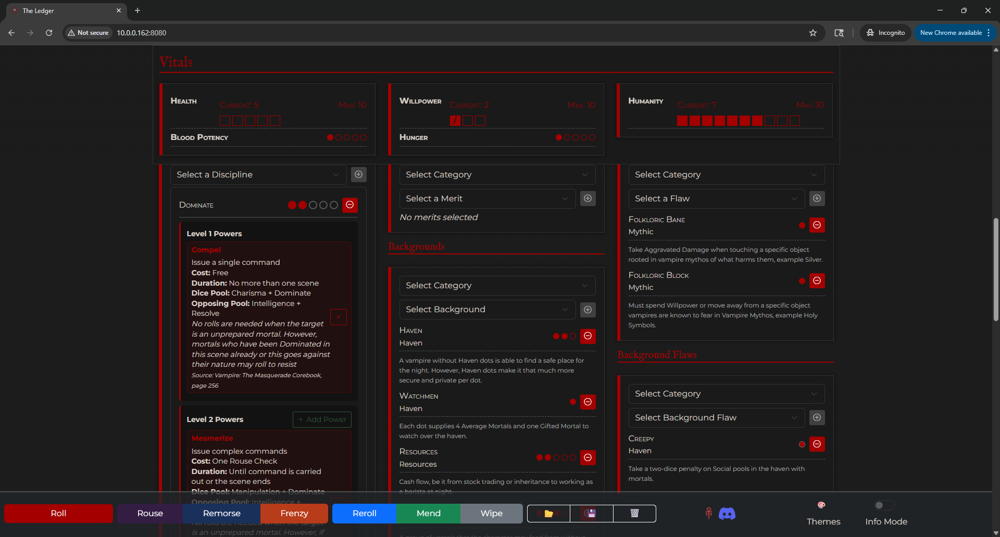

# 🧛 **The Ledger**

*A Vampire: The Masquerade 5th Edition character ledger*

[](https://github.com/atrobjustice/The-Ledger/releases)
[](LICENSE.md)

---

## Table of Contents

1. [About](#about)
2. [Demo](#demo)
3. [Features](#features)
4. [Getting Started](#getting-started)
5. [Development](#development)
6. [Folder Structure](#folder-structure)
7. [User Guide](#user-guide)
8. [Acknowledgements](#acknowledgements)
9. [License](#license)

---

## About

**The Ledger** is an offline-first, responsive web application for building and tracking characters in *Vampire: The Masquerade* 5th Edition (V5). Think of it as the digital equivalent of the classic paper character sheet—always at hand, version-controlled, and ready to print.

The project started as a small experiment based on the 3D dice roller from [@prncc/vampire-dice-roller](https://github.com/prncc/vampire-dice-roller), and quickly grew after importing rules logic, data files, and plenty of inspiration from the fantastic [@Odin94/Progeny-vtm-v5-character-creator](https://github.com/Odin94/Progeny-vtm-v5-character-creator/). Huge thanks to both projects for lighting the way!

---

## Demo

Clone the repository and open `index.html`, or visit the [live version](https://atrobjustice.github.io/The-Ledger/).



---

## Features

- 📄 **Complete Character Sheet**
  - All core V5 character sheet sections
  - Theme-aware form controls
  - Responsive design for all devices

- 🎲 **Enhanced Dice System**
  - Optional 3-D dice roller overlay
  - Hunger dice integration with visual indicators
  - Critical & messy critical handling
  - Difficulty-based success/failure determination
  - Discord webhook integration with structured formatting

- 💾 **Advanced Data Management**
  - 100% client-side – nothing is sent to a server
  - **Multiple character support** with IndexedDB storage
  - JSON export/import for backups
  - Progeny VTM character import compatibility
  - Automatic data persistence and recovery

- 🎨 **Rich UI/UX Features**
  - 15 clan-specific themes plus Blood & Roses (dark) and Ivory Tower (light)
  - Dark/Light mode support with accessibility considerations
  - Responsive design optimized for mobile and desktop
  - Keyboard navigation and screen reader support
  - High contrast alternatives for accessibility

- 🔒 **Lock / Play Mode**
  - One-click toggle to freeze the entire sheet during play
  - Prevents accidental edits during game sessions
  - Locked status persisted across sessions and exports

- 📈 **Experience Points (XP) Tracker**
  - Dedicated modal for logging earned and spent XP
  - Automatic calculation of Total, Spent, and Available XP
  - Full undo/redo history with autosave
  - IndexedDB persistence for reliability

- 🛈 **Comprehensive Rules Reference**
  - Contextual info buttons throughout the interface
  - Detailed rules text for Attributes, Skills, Disciplines, Merits, Flaws, Backgrounds, and more
  - Integrated Humanity ladder with detailed effects
  - Conviction & Touchstone system with dedicated tracking
  - Dice symbols help modal for quick reference

- 👥 **Multiple Character Management**
  - Create and manage unlimited characters
  - Easy character switching with dropdown selector
  - Character management modal for organizing your roster
  - Each character maintains separate XP, settings, and data
  - Seamless character switching with state preservation

- 🎯 **Advanced Game Mechanics**
  - Blood Surge mechanic with automatic dice-pool handling
  - Impairment status tracking with UI indicators
  - Resonance and Temperament tracking
  - Blood Potency bonus dice and Rouse rerolls
  - Conviction & Touchstone system (up to 3 active convictions)

- 🔍 **Development & Debugging**
  - Configurable console logging system
  - Toggle logging on/off via settings
  - Automatic environment detection (development vs production)
  - Persistent logging preferences
  - Comprehensive error tracking and debugging support

---

## Getting Started

1. **Clone** the repo
   ```bash
   git clone https://github.com/atrobjustice/Ledger.git
   cd Ledger
   ```

2. **Install** dev dependencies (only needed if you want to re-compile SCSS)
   ```bash
   npm install
   ```

3. **Run** the SCSS watcher (optional)
   ```bash
   npm run sass
   ```

4. **Open** `index.html` in your favorite browser – that's it! No build step required.

### Multiple Character Support

The Ledger supports multiple characters using IndexedDB storage exclusively:

- **Character Selector**: Use the dropdown in the control bar to switch between characters
- **New Character**: Click the "+" button to create a new character
- **Character Management**: Click the gear icon to manage your character roster
- **Data Persistence**: All character data is automatically saved and persists between sessions

---

## Development

All styling lives in `scss/` and is compiled to `css/` using [`sass`](https://sass-lang.com/). The following npm scripts are available:

| Script | Purpose |
| -------------- | ----------------------------------------- |
| `npm run sass` | Watch `scss/` and re-compile on changes |
| `npm run sass:build` | One-off, minified production build |

For detailed technical documentation, see [DOCUMENTATION.md](DOCUMENTATION.md).

### Logging System

The Ledger includes a comprehensive logging system for development and debugging:

- **Toggle Control**: Enable/disable logging via Settings → General → "Enable console logging"
- **Environment Detection**: Automatically defaults to enabled in development, disabled in production
- **Persistent Settings**: Logging preference is saved and restored between sessions
- **Comprehensive Coverage**: All major operations are logged with appropriate levels (log, warn, error, info, debug)
- **Testing**: Use `test-logger.html` to test the logging system functionality

The logging system uses the `js/core/utils/logger.js` module and provides:
- Timestamped log messages with consistent formatting
- Support for all console methods (log, warn, error, info, debug, group, table, time)
- Automatic environment detection based on hostname
- localStorage persistence for user preferences

### Project Structure

The application is built with vanilla JavaScript using a modular architecture:

- **Managers**: Core functionality modules in `js/core/managers/`
- **UI Components**: Interface components in `js/core/ui/`
- **Data**: Game rules and reference data in `js/data/`
- **Utilities**: Helper functions and game logic in `js/core/utils/`

Feel free to raise issues or open pull requests – contributions are welcome!

---

## Folder Structure

```text
Ledger/
├── assets/           # images, fonts, icons
├── css/              # compiled CSS (git-ignored in dev)
├── scss/             # source SCSS files
│   ├── base/         # typography, utilities
│   ├── components/   # reusable UI components
│   ├── layout/       # layout-specific styles
│   └── features/     # feature-specific styles
├── js/               # JavaScript modules
│   ├── core/
│   │   ├── managers/ # core functionality managers
│   │   ├── ui/       # interface components
│   │   └── utils/    # helper functions
│   ├── data/         # game rules and reference data
│   ├── integrations/ # external integrations
│   └── lib/          # third-party libraries
├── data/             # JSON character data
├── reference/        # additional reference materials
├── index.html        # main entry point
├── character-sheet.html # alternative character sheet view
├── DOCUMENTATION.md  # technical documentation
├── USER_GUIDE.md     # user documentation
├── CHANGELOG.md      # version history
└── package.json      # npm scripts & dev dependencies
```

---

## User Guide

For detailed instructions on using The Ledger, see [USER_GUIDE.md](USER_GUIDE.md). The guide covers:

- Creating and managing characters
- Using the dice roller
- Understanding the XP system
- Working with themes and accessibility
- Importing/exporting character data

---

## Acknowledgements

- **Dice Roller:** [prncc/vampire-dice-roller](https://github.com/prncc/vampire-dice-roller)
- **Inspiration:** [Odin94/Progeny-vtm-v5-character-creator](https://github.com/Odin94/Progeny-vtm-v5-character-creator/)
- **Reference Data:** [VTM Wiki](https://vtm.paradoxwikis.com/VTM_Wiki) – thank you to the community for curating the *Vampire: The Masquerade* knowledge base.
- *Vampire: The Masquerade* and the World of Darkness are properties of Paradox Interactive AB. This project is a non-commercial fan work under the Dark Pack guidelines.

---

## License

Distributed under the MIT License. See [LICENSE.md](LICENSE.md) for more information. 